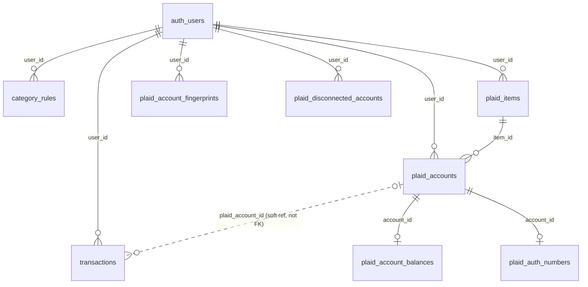

# Database schema

Reference for every table, constraint, and RLS policy in the `public`
schema of this app's Supabase Postgres database. This reflects the **live**
schema (introspected directly from the database, not hand-transcribed from
migration files), current as of 2026-08-06.

The source of truth for schema *changes* is `supabase/migrations/` — this
file is a snapshot for orientation, not a substitute for reading a specific
migration when you need to know exactly why a column exists. Each table
section below links to the migration(s) that created or altered it.

If you change the schema, please update this file in the same PR.

## Contents

- [Overview](#overview)
- [Security model](#security-model)
- [Tables](#tables)
  - [`transactions`](#transactions)
  - [`category_rules`](#category_rules)
  - [`plaid_items`](#plaid_items)
  - [`plaid_accounts`](#plaid_accounts)
  - [`plaid_account_balances`](#plaid_account_balances)
  - [`plaid_auth_numbers`](#plaid_auth_numbers)
  - [`plaid_account_fingerprints`](#plaid_account_fingerprints)
  - [`plaid_disconnected_accounts`](#plaid_disconnected_accounts)
  - [`query_rate_limits`](#query_rate_limits)
  - [`sync_health`](#sync_health)
- [Functions](#functions)
- [Scheduled jobs](#scheduled-jobs)

## Overview

Two logical groups of tables:

- **The ledger**: `transactions` + `category_rules`. This is what the app's
  Ask/Home pages actually query and display.
- **The Plaid bank-sync layer**: `plaid_items`, `plaid_accounts`,
  `plaid_account_balances`, `plaid_auth_numbers`, `plaid_account_fingerprints`,
  `plaid_disconnected_accounts`. These hold live bank connections and feed
  `transactions` (via server-side sync), but are never queried directly by
  the NL-query system — they're plumbing, not ledger data.

`auth.users` is Supabase's own managed table (the `auth` schema, not
`public`) — every `user_id` column below is a foreign key into it.

`transactions.plaid_account_id` is deliberately **not** a foreign key (see
[`transactions`](#transactions) below) — that's a load-bearing design
choice, not an oversight.

## Security model

Every table here has Row Level Security (RLS) **enabled**. Two different
patterns are used, depending on sensitivity:

1. **Normal per-user tables** (`transactions`, `category_rules`,
   `plaid_accounts`, `plaid_account_balances`): an RLS policy scoped to
   `(select auth.uid()) = user_id`. Server code that reads these on a
   user's behalf (`supabase/functions/transactions/index.ts`,
   `supabase/functions/query/index.ts`) forwards the
   *caller's own* Supabase access token to PostgREST rather than using a
   service-role key — so it's Postgres itself, not application code,
   that restricts each request to its own rows. The `select`-wrapped
   form (rather than a bare `auth.uid() = user_id`) lets Postgres
   evaluate `auth.uid()` once per query instead of once per row scanned
   — see
   [`20260806000000_fix_rls_auth_uid_initplan.sql`](supabase/migrations/20260806000000_fix_rls_auth_uid_initplan.sql),
   a fix for a perf lint Supabase's own advisor flags
   (`auth_rls_initplan`).

2. **Secret-holding or internal-only tables** (`plaid_items`,
   `plaid_auth_numbers`, `plaid_account_fingerprints`,
   `plaid_disconnected_accounts`): RLS enabled with **no policies at all**
   for `anon`/`authenticated` — only the service-role key (used
   exclusively in trusted server code: Supabase Edge Functions) can touch
   them. `plaid_items` has one
   narrow exception — a column-level `GRANT` exposing just
   `id, institution_name, status, created_at` to `authenticated`, paired
   with a normal `(select auth.uid()) = user_id` SELECT policy, so the client can
   show "is a bank linked yet" without ever being able to read
   `access_token` or `cursor`. See
   [`20260802010000_lock_down_plaid_items_columns.sql`](supabase/migrations/20260802010000_lock_down_plaid_items_columns.sql)
   — an earlier version of this grant was briefly broader than intended
   (caught and fixed before any real access token was ever stored).

Every client-facing Edge Function is additionally gated by `verify_jwt`
(enabled by default), which rejects any request without a currently-valid
Supabase JWT before it reaches the function's own code — see
`supabase/functions/_shared/requireUser.ts`.

## Tables

### `transactions`

The ledger itself — one row per transaction, manual or bank-synced.

| Column | Type | Nullable | Default | Notes |
|---|---|---|---|---|
| `id` | `bigint` | no | auto | Primary key. |
| `date` | `date` | no | | `YYYY-MM-DD`. |
| `payee` | `text` | no | | Cleaned/display payee (see `raw_payee`). |
| `category` | `text` | no | | `Top:Sub` format (e.g. `Home:Rent`). Always one of a closed set — see `apply_category_rules()`. |
| `amount` | `numeric` | no | | Negative = expense, positive = income. |
| `user_id` | `uuid` | **yes** | | FK → `auth.users.id`. Nullable only because pre-auth rows predate this column; every row written since has one. |
| `plaid_transaction_id` | `text` | yes | | **Unique.** Plaid's own transaction id. `null` for manual rows. This is what makes the sync path idempotent — re-processing the same transaction always upserts the same row instead of inserting a duplicate. |
| `plaid_account_id` | `text` | yes | | Which Plaid account this came from. **Not a foreign key** — see callout below. Indexed. |
| `source` | `text` | no | `'manual'` | `manual` \| `plaid` (checked). |
| `is_transfer` | `boolean` | no | `false` | Excluded from spend/income totals by default when true. For `source='plaid'` rows, true only when Plaid classified the transaction `TRANSFER_IN`/`TRANSFER_OUT` **and** the user has 2+ linked `plaid_accounts` (see `apply_category_rules()`) — Plaid's classification alone doesn't mean the other side is an account this app also tracks (a mortgage or alimony payment gets the same `TRANSFER_OUT` classification as a real inter-account transfer), so with fewer than 2 tracked accounts nothing here can be double-counted and it's treated as real spend/income instead. For `source='manual'` rows this is whatever was set at import time, independent of Plaid's taxonomy. |
| `raw_payee` | `text` | yes | | Original, untouched payee (Plaid's or the pre-existing manual value) — never modified by the category-rules engine, so rules can always re-match against the true source value regardless of how many times they've been re-applied. |
| `raw_category` | `text` | yes | | Same idea, for category. |
| `manually_edited` | `boolean` | no | `false` | True once payee/category was set directly via the row editor (`mobile/components/TransactionRow.tsx`) rather than by a rule. `apply_category_rules()` skips these rows entirely, and the Plaid sync path (`syncItemTransactions.ts`) stops upserting new data into them — both so a direct edit isn't silently reverted by an unrelated rule change or a later Plaid update to the same transaction. |

**Constraints:** PK `id`; unique `plaid_transaction_id`; FK `user_id → auth.users(id)`; check `source in ('manual','plaid')`.
**Indexes:** `plaid_account_id`, `(user_id, date desc)`, `(user_id, category, date desc)`. The standalone `date` and `category` indexes this table originally had were dropped — every real query against this table is user-scoped (via RLS or an explicit `user_id =` filter), so a bare table-wide index on either column was never actually selective for the app's access pattern and just cost write overhead on every Plaid-synced insert. See
[`20260806020000_replace_transactions_date_category_indexes.sql`](supabase/migrations/20260806020000_replace_transactions_date_category_indexes.sql).
**RLS:** `(select auth.uid()) = user_id`, split into a `SELECT` policy and an `UPDATE` policy — deliberately **no** `INSERT`/`DELETE` policy for `authenticated`. The app's only write path is a targeted `UPDATE` by row `id` (`mobile/components/TransactionRow.tsx`'s payee/category edit); there's no add- or delete-transaction feature in the client, so those verbs were pure unused headroom — a leaked access token or a stray API call could otherwise wipe a user's entire ledger in one unscoped `DELETE`. `service_role` (the Plaid sync path, `apply_category_rules()`) is unaffected either way — it bypasses RLS entirely.

> **Why `plaid_account_id` has no FK:** Plaid's sync APIs return data for
> *every* account under a bank connection (Item), including any account
> `supabase/functions/plaid-exchange/index.ts` deliberately chose not to
> track as a duplicate of one you already have. A hard FK would make that
> filtering a database error instead of an application-level choice. The
> filtering happens in `syncItemTransactions.ts` and
> `refreshAccountBalances.ts` instead — see
> [`supabase/functions/plaid-exchange/index.ts`](supabase/functions/plaid-exchange/index.ts) and
> [`supabase/functions/_shared/syncItemTransactions.ts`](supabase/functions/_shared/syncItemTransactions.ts).

Origin: [`20260730231500_add_user_id_and_rls_to_transactions.sql`](supabase/migrations/20260730231500_add_user_id_and_rls_to_transactions.sql),
[`20260802000000_add_plaid_integration_schema.sql`](supabase/migrations/20260802000000_add_plaid_integration_schema.sql),
[`20260803000000_add_is_transfer_to_transactions.sql`](supabase/migrations/20260803000000_add_is_transfer_to_transactions.sql),
[`20260803010000_add_category_rules_engine.sql`](supabase/migrations/20260803010000_add_category_rules_engine.sql)
(`raw_payee`/`raw_category`),
[`20260806000000_fix_rls_auth_uid_initplan.sql`](supabase/migrations/20260806000000_fix_rls_auth_uid_initplan.sql),
[`20260806020000_replace_transactions_date_category_indexes.sql`](supabase/migrations/20260806020000_replace_transactions_date_category_indexes.sql),
[`20260804010000_add_manually_edited_to_transactions.sql`](supabase/migrations/20260804010000_add_manually_edited_to_transactions.sql)
(`manually_edited`),
[`20260805030000_narrow_transactions_rls.sql`](supabase/migrations/20260805030000_narrow_transactions_rls.sql)
(split `ALL` policy into `SELECT`/`UPDATE`, dropping unused `INSERT`/`DELETE`).

### `category_rules`

User-defined "if payee/category contains X, set category/payee to Y"
rules — same mental model as an email filter with "apply to existing"
checked. Applied both retroactively (`apply_category_rules()`) and
going forward, in the live Plaid sync path.

| Column | Type | Nullable | Default | Notes |
|---|---|---|---|---|
| `id` | `uuid` | no | `gen_random_uuid()` | Primary key. |
| `user_id` | `uuid` | no | | FK → `auth.users.id`, cascades on delete. |
| `priority` | `integer` | no | `100` | Ascending order; ties broken by `created_at`. Higher-priority (later-applied) matches overwrite earlier ones for whichever field they set. |
| `match_field` | `text` | no | | `payee` \| `category` (checked). |
| `match_value` | `text` | no | | Case-insensitive "contains" match. |
| `set_category` | `text` | yes | | Null = don't change category. |
| `set_payee` | `text` | yes | | Null = don't change payee. |
| `enabled` | `boolean` | no | `true` | |
| `created_at` | `timestamptz` | no | `now()` | |
| `updated_at` | `timestamptz` | no | `now()` | |

**Constraints:** PK `id`; FK `user_id → auth.users(id)` (cascade delete); check `match_field in ('payee','category')`.
**Indexes:** `(user_id, priority)` — covers both the RLS filter and `mobile/components/CategoryRulesPanel.tsx`'s `order("priority")`.
**RLS:** `(select auth.uid()) = user_id`, `for all`.

Origin: [`20260803010000_add_category_rules_engine.sql`](supabase/migrations/20260803010000_add_category_rules_engine.sql),
[`20260806000000_fix_rls_auth_uid_initplan.sql`](supabase/migrations/20260806000000_fix_rls_auth_uid_initplan.sql),
[`20260806010000_add_missing_user_id_indexes.sql`](supabase/migrations/20260806010000_add_missing_user_id_indexes.sql).

### `plaid_items`

One row per linked bank connection ("Item" in Plaid's terminology). Holds
the live access token — the most sensitive row in this schema.

| Column | Type | Nullable | Default | Notes |
|---|---|---|---|---|
| `id` | `uuid` | no | `gen_random_uuid()` | Primary key. |
| `user_id` | `uuid` | no | | FK → `auth.users.id`, cascades on delete. |
| `item_id` | `text` | no | | **Unique.** Plaid's own Item id. |
| `access_token` | `text` | no | | **Secret.** Never exposed to any client role — service-role only. |
| `institution_id` | `text` | yes | | Plaid's institution id (e.g. `ins_56`). |
| `institution_name` | `text` | yes | | Display name (e.g. "Chase"). Client-readable. |
| `cursor` | `text` | yes | | `/transactions/sync` cursor — internal sync bookmark, service-role only. |
| `status` | `text` | no | `'active'` | `active` \| `error` \| `pending_expiration` \| `revoked` (checked). Client-readable. |
| `created_at` | `timestamptz` | no | `now()` | Client-readable. |
| `updated_at` | `timestamptz` | no | `now()` | |

**Constraints:** PK `id`; unique `item_id`; FK `user_id → auth.users(id)` (cascade delete); check `status` enum.
**Indexes:** `user_id`.
**RLS:** one `SELECT` policy, `(select auth.uid()) = user_id` — combined with a column-level `GRANT` restricting `authenticated` to `id, institution_name, status, created_at` only (see [Security model](#security-model)). No `anon` access at all. No `INSERT`/`UPDATE`/`DELETE` policy for any client role — every write goes through service-role code (`supabase/functions/plaid-exchange/index.ts`, `supabase/functions/plaid-disconnect/index.ts`, the `plaid-webhook` Edge Function).

Origin: [`20260802000000_add_plaid_integration_schema.sql`](supabase/migrations/20260802000000_add_plaid_integration_schema.sql),
[`20260802000200_plaid_items_status_read_policy.sql`](supabase/migrations/20260802000200_plaid_items_status_read_policy.sql),
[`20260802010000_lock_down_plaid_items_columns.sql`](supabase/migrations/20260802010000_lock_down_plaid_items_columns.sql),
[`20260806000000_fix_rls_auth_uid_initplan.sql`](supabase/migrations/20260806000000_fix_rls_auth_uid_initplan.sql),
[`20260806010000_add_missing_user_id_indexes.sql`](supabase/migrations/20260806010000_add_missing_user_id_indexes.sql).

### `plaid_accounts`

One row per linked bank *account* (a `plaid_items` row can have several —
e.g. checking + savings at the same bank).

| Column | Type | Nullable | Default | Notes |
|---|---|---|---|---|
| `id` | `uuid` | no | `gen_random_uuid()` | Primary key. |
| `item_id` | `uuid` | no | | FK → `plaid_items.id`, cascades on delete. |
| `user_id` | `uuid` | no | | FK → `auth.users.id`, cascades on delete. |
| `account_id` | `text` | no | | **Unique.** Plaid's own account id — scoped per Item (see the duplicate-account note below). |
| `name` | `text` | yes | | e.g. "TOTAL CHECKING". |
| `mask` | `text` | yes | | Last 4 digits, as Plaid reports them. |
| `type` | `text` | yes | | e.g. `depository`. |
| `subtype` | `text` | yes | | e.g. `checking`, `savings`. |
| `created_at` | `timestamptz` | no | `now()` | |
| `resync_after_date` | `date` | yes | | See callout below. Set only when this account is a relink of one the user disconnected before. |

**Constraints:** PK `id`; unique `account_id`; FK `item_id → plaid_items(id)` (cascade delete); FK `user_id → auth.users(id)` (cascade delete).
**Indexes:** `user_id`, `item_id`.
**RLS:** `(select auth.uid()) = user_id`, `SELECT` only. Writes are service-role only.

> **Why a row here doesn't necessarily mean "a real distinct account":**
> Plaid mints a brand-new `account_id` every time a bank is linked, even
> for an account you already connected — Plaid has no concept of "you
> already have this." `supabase/functions/plaid-exchange/index.ts` is
> what prevents a real duplicate account from ever getting a row here: it
> matches a newly linked account against your existing *active* accounts
> (by Auth account/routing number, falling back to institution + mask +
> type when Auth isn't available) and skips inserting anything that
> matches. See `partitionDuplicateAccounts` in
> [`supabase/functions/_shared/plaidExchangeLogic.ts`](supabase/functions/_shared/plaidExchangeLogic.ts),
> and its tests in
> [`supabase/functions/_shared/plaidExchangeLogic.test.ts`](supabase/functions/_shared/plaidExchangeLogic.test.ts).

> **`resync_after_date` — disconnect-then-relink of the same account:**
> disconnecting (`supabase/functions/plaid-disconnect/index.ts`)
> intentionally keeps transaction history but deletes the
> `plaid_accounts` row itself. Relinking the same real account later
> always gets a brand-new `account_id`, and Plaid's fresh Item resyncs
> its historical window (up to `days_requested` days back — 730, set in
> `supabase/functions/plaid-link-token/index.ts`) regardless of how much
> history already exists in `transactions` — with no `resync_after_date`
> handling, that resync would duplicate whatever part of the account's
> history it covers. `supabase/functions/plaid-exchange/index.ts`
> recognizes a relink of a previously-seen account via
> [`plaid_account_fingerprints`](#plaid_account_fingerprints) (which
> survives disconnect, unlike this table) and sets this to the latest date
> already covered; `syncItemTransactions.ts` skips inserting anything
> dated strictly before it. The boundary date itself is re-fetched too
> (Plaid's `date` has no time component, so a transaction that posted
> later the same calendar day — after the user had already disconnected —
> would otherwise share a date with an already-synced row and be silently
> lost); transactions on that one ambiguous day are cross-checked against
> the existing ledger by date + amount instead, so already-covered ones
> are dropped as duplicates while genuinely new ones are kept. Only
> possible when Auth numbers were available at link time — see the
> fingerprints table below. Note this only backfills a disconnect gap up
> to `days_requested` (730 days) long; a longer gap still leaves a real
> hole, since Plaid itself doesn't resync further back than that. None of
> this matters past 90 days disconnected anyway — see
> [`plaid_disconnected_accounts`](#plaid_disconnected_accounts): the
> account's transaction history (and its fingerprint) gets purged before a
> relink that late could ever use this boundary.

Origin: [`20260802000000_add_plaid_integration_schema.sql`](supabase/migrations/20260802000000_add_plaid_integration_schema.sql),
[`20260804000000_plaid_account_fingerprints.sql`](supabase/migrations/20260804000000_plaid_account_fingerprints.sql) (`resync_after_date`).

### `plaid_account_balances`

Latest known balance per account. Upserted, not appended — one row per
account, always overwritten with the newest value.

| Column | Type | Nullable | Default | Notes |
|---|---|---|---|---|
| `account_id` | `text` | no | | **Primary key.** FK → `plaid_accounts.account_id`, cascades on delete. |
| `user_id` | `uuid` | no | | FK → `auth.users.id`, cascades on delete. |
| `available` | `numeric` | yes | | |
| `current` | `numeric` | yes | | The "ledger" balance the app displays, preferring this over `available`. |
| `iso_currency_code` | `text` | yes | | |
| `as_of` | `timestamptz` | no | `now()` | When this balance was last fetched from Plaid. |

**Constraints:** PK `account_id`; FK `account_id → plaid_accounts(account_id)` (cascade delete); FK `user_id → auth.users(id)` (cascade delete).
**Indexes:** `user_id`.
**RLS:** `(select auth.uid()) = user_id`, `SELECT` only. Writes are service-role only (`refreshAccountBalances.ts`, shared by the hourly cron and every transaction-sync webhook).

Refreshed hourly (see [Scheduled jobs](#scheduled-jobs)) and opportunistically on every transaction webhook, since Plaid's Balance product has no webhook of its own.

Origin: [`20260802000000_add_plaid_integration_schema.sql`](supabase/migrations/20260802000000_add_plaid_integration_schema.sql),
[`20260806000000_fix_rls_auth_uid_initplan.sql`](supabase/migrations/20260806000000_fix_rls_auth_uid_initplan.sql),
[`20260806010000_add_missing_user_id_indexes.sql`](supabase/migrations/20260806010000_add_missing_user_id_indexes.sql).

### `plaid_auth_numbers`

Real account/routing numbers, from Plaid's Auth product. The other
most-sensitive table here.

| Column | Type | Nullable | Default | Notes |
|---|---|---|---|---|
| `account_id` | `text` | no | | **Primary key.** FK → `plaid_accounts.account_id`, cascades on delete. |
| `user_id` | `uuid` | no | | FK → `auth.users.id`, cascades on delete. |
| `account_number` | `text` | no | | **Secret.** |
| `routing_number` | `text` | no | | **Secret.** |
| `wire_routing_number` | `text` | yes | | **Secret.** Not every institution provides one. |
| `created_at` | `timestamptz` | no | `now()` | |

**Constraints:** PK `account_id`; FK `account_id → plaid_accounts(account_id)` (cascade delete); FK `user_id → auth.users(id)` (cascade delete).
**Indexes:** `user_id`.
**RLS:** enabled, **zero policies** for any client role — not even the owning user can read this table directly. Service-role only. If the UI ever needs to show a masked routing number, that must go through a dedicated server endpoint that masks it, never a direct table select.

Not populated for every account — Auth isn't available for every institution; `supabase/functions/plaid-exchange/index.ts` treats it as best-effort and doesn't fail a link if it's missing. These numbers double as the primary signal for cross-Item duplicate-account detection (see `plaid_accounts` above).

Origin: [`20260802000000_add_plaid_integration_schema.sql`](supabase/migrations/20260802000000_add_plaid_integration_schema.sql),
[`20260806010000_add_missing_user_id_indexes.sql`](supabase/migrations/20260806010000_add_missing_user_id_indexes.sql).

### `plaid_account_fingerprints`

An append-only, indefinitely-retained record of every real bank account
this user has ever linked — the one thing that survives a full disconnect
(unlike `plaid_accounts`/`plaid_auth_numbers`, which are cascade-deleted),
so a later relink of the same real account can be recognized.

| Column | Type | Nullable | Default | Notes |
|---|---|---|---|---|
| `id` | `uuid` | no | `gen_random_uuid()` | Primary key. |
| `user_id` | `uuid` | no | | FK → `auth.users.id`, cascades on delete. |
| `fingerprint` | `text` | no | | `sha256(account_number:routing_number)`, hex. **One-way** — see callout below. |
| `account_id` | `text` | no | | The `plaid_accounts.account_id` this fingerprint was recorded under. **Not a foreign key** — that row may already be deleted by the time this is read (that's the point: it's a historical record, not a live reference). |
| `institution_id` | `text` | yes | | |
| `created_at` | `timestamptz` | no | `now()` | |

**Constraints:** PK `id`; FK `user_id → auth.users(id)` (cascade delete). No constraint on `account_id` (deliberately not a live reference — see above).
**Indexes:** `(user_id, fingerprint)`.
**RLS:** enabled, **zero policies** for any client role — service-role only, same treatment as `plaid_items`/`plaid_auth_numbers`.

> **Why a hash, not the real numbers:** unlike `plaid_auth_numbers`, this
> table survives disconnect — including long after the account it
> describes has been disconnected, up to the 90-day purge described below
> — so it must never hold anything reversible to a real account/routing
> number. `fingerprintFor()` in
> [`supabase/functions/_shared/plaidExchangeLogic.ts`](supabase/functions/_shared/plaidExchangeLogic.ts)
> computes a SHA-256 hash of `account_number:routing_number` instead; see
> its tests in
> [`supabase/functions/_shared/plaidExchangeLogic.test.ts`](supabase/functions/_shared/plaidExchangeLogic.test.ts).
> One row is
> written per successfully linked account (only when Auth numbers were
> available for it) — never updated, so a given real account can have
> multiple rows here across however many times it's been
> linked/disconnected/relinked over time. A row *is* deleted, though, the
> same moment its account's transaction history is purged — see
> [`plaid_disconnected_accounts`](#plaid_disconnected_accounts).

Origin: [`20260804000000_plaid_account_fingerprints.sql`](supabase/migrations/20260804000000_plaid_account_fingerprints.sql).

### `plaid_disconnected_accounts`

Tracks when each disconnected account_id stopped being linked, purely so
the 90-day retention job below knows how long it's been gone — that
information doesn't survive anywhere else once `plaid_accounts` is
cascade-deleted at disconnect time.

| Column | Type | Nullable | Default | Notes |
|---|---|---|---|---|
| `id` | `uuid` | no | `gen_random_uuid()` | Primary key. |
| `user_id` | `uuid` | no | | FK → `auth.users.id`, cascades on delete. |
| `account_id` | `text` | no | | **Unique.** The `plaid_accounts.account_id` that was just disconnected. Not a foreign key — the row it names is already gone by the time this is written (cascade order, same reasoning as `plaid_account_fingerprints`). |
| `fingerprint` | `text` | yes | | Copied from `plaid_account_fingerprints` for this `account_id` at disconnect time, if one exists. Lets the purge job tell "genuinely gone 90+ days" apart from "relinked under a new account_id in the meantime" — `account_id` alone can't, since Plaid never reuses one. |
| `disconnected_at` | `timestamptz` | no | `now()` | |

**Constraints:** PK `id`; unique `account_id`; FK `user_id → auth.users(id)` (cascade delete).
**Indexes:** `(disconnected_at)`, `user_id`.
**RLS:** enabled, **zero policies** for any client role — service-role only, same treatment as `plaid_items`/`plaid_auth_numbers`. Purely internal bookkeeping; no client ever reads or writes this directly.

Written by `supabase/functions/plaid-disconnect/index.ts`, one row per account, right before the `plaid_items` delete cascades `plaid_accounts` away. Consumed and deleted by `purge_stale_disconnected_transactions()` (see [Functions](#functions)) — rows here are transient, not meant to accumulate.

Origin: [`20260805010000_purge_stale_disconnected_transactions.sql`](supabase/migrations/20260805010000_purge_stale_disconnected_transactions.sql),
[`20260806010000_add_missing_user_id_indexes.sql`](supabase/migrations/20260806010000_add_missing_user_id_indexes.sql).

### `query_rate_limits`

Backs `check_and_increment_query_rate_limit()` below — one row per user tracking the current rate-limit window for the `query` Edge Function's Anthropic calls.

| Column | Type | Nullable | Default | Notes |
|---|---|---|---|---|
| `user_id` | `uuid` | no | | Primary key. FK → `auth.users.id`, cascades on delete. |
| `window_start` | `timestamptz` | no | `now()` | Start of the current sliding window; reset once the window has elapsed. |
| `count` | `integer` | no | `0` | Requests seen so far in the current window. |

**Constraints:** PK `user_id`; FK `user_id → auth.users(id)` (cascade delete).
**RLS:** enabled, **zero policies** for any client role — same treatment as `plaid_items`/`plaid_disconnected_accounts`. Only `check_and_increment_query_rate_limit()` (`SECURITY DEFINER`) reads or writes this table; no client ever touches it directly.

Origin: [`20260818000000_add_query_rate_limit.sql`](supabase/migrations/20260818000000_add_query_rate_limit.sql).

### `sync_health`

Current ingest health, one row per **active** `plaid_items` row, rewritten by `check_plaid_sync_health()` on every hourly tick.

This exists because of a real five-day outage. Transactions are webhook-only, and `plaid_items.cursor` only advances after a fully successful sync — so a sync that throws pins the cursor and every later webhook replays the identical failure. Nothing surfaced it: `plaid-balance-refresh` kept polling balances on its own independent hourly path, so the app went on showing a live, correct balance beside a ledger frozen five days back.

Current state rather than an append-only log — the useful question is "is ingest working right now", and a row per item per hour would grow without ever being read. `stale_since` is the one piece of history worth keeping: it answers "since when", which is what turns an alert into a diagnosis.

| Column | Type | Nullable | Default | Notes |
|---|---|---|---|---|
| `item_id` | `text` | no | | Primary key. FK → `plaid_items.item_id`, cascades on delete — disconnecting a bank clears its health row rather than leaving a permanently stale orphan that alerts forever. |
| `user_id` | `uuid` | no | | FK → `auth.users.id`, cascades on delete. |
| `last_synced_at` | `timestamptz` | no | | Copy of `plaid_items.updated_at` as of the check — the last time a sync completed successfully. |
| `is_stale` | `boolean` | no | | True when `last_synced_at` is older than the threshold (default 24h — four missed resync cycles, so one transient failure isn't a false alarm). |
| `stale_since` | `timestamptz` | yes | | When the item **first** went stale in the current incident; preserved across consecutive stale checks, cleared on recovery. |
| `checked_at` | `timestamptz` | no | `now()` | When the health check last ran for this item. Distinguishes "checked and healthy" from "the check itself stopped running". |

**Constraints:** PK `item_id`; FK `item_id → plaid_items(item_id)` (cascade delete); FK `user_id → auth.users(id)` (cascade delete). Index on `user_id`.
**RLS:** enabled. `authenticated` holds `SELECT` and one policy — `auth.uid() = user_id` — so the app can surface "your bank feed is behind" without a further migration. No client write path at all: only the `SECURITY DEFINER` health check (and the service role, which bypasses RLS) writes here.

Origin: [`20260819190000_add_sync_health_and_resync_cron.sql`](supabase/migrations/20260819190000_add_sync_health_and_resync_cron.sql).

## Functions

| Function | Security | Returns | Purpose |
|---|---|---|---|
| `check_and_increment_query_rate_limit(integer, integer)` | `DEFINER` | one row: `allowed boolean, retry_after_seconds integer` | Sliding-window rate limit (default 20 requests / 300s) for the `query` Edge Function's per-call Anthropic spend, enforced in the database so it can't be bypassed by calling PostgREST directly instead of going through the Edge Function. `SECURITY DEFINER` because a bare `authenticated`/RLS grant can't atomically upsert-and-check another user's-eye-view of `query_rate_limits` in one statement without a policy that would let a caller inspect (not just increment) it; scoped internally to `auth.uid()` (raises if null) so a caller can still only ever touch their own row. `EXECUTE` is revoked from `anon`/`public`, granted only to `authenticated` — same lockdown pattern as `purge_stale_disconnected_transactions()`. See `checkQueryRateLimit()` in [`supabase/functions/_shared/rateLimit.ts`](supabase/functions/_shared/rateLimit.ts), called from [`supabase/functions/query/index.ts`](supabase/functions/query/index.ts). |
| `apply_category_rules()` | `INVOKER` | `integer` (rows affected) | Resets every one of the caller's transactions to its `raw_payee`/`raw_category`, then re-applies their `category_rules` in priority order. Also recomputes `is_transfer` for every `source='plaid'` row: true only when Plaid classified it `TRANSFER_IN`/`TRANSFER_OUT` **and** the user has 2+ linked `plaid_accounts` — with fewer than 2, there's no second tracked account for a "transfer" to double-count against, so it's treated as real spend/income instead (this is what previously made mortgage/alimony/etc. payments vanish from every total once Plaid classified them as transfers). Skips any row with `manually_edited = true` entirely (reset step, every rule pass, and the `is_transfer` recompute), so a direct row edit isn't reverted by an unrelated rule change. Always scoped to `auth.uid()` internally — takes no parameters, so a caller can never target another user's rows through it. Invoked automatically by `mobile/components/CategoryRulesPanel.tsx` after every rule add/toggle/delete — there's no manual "reapply" step for the user. |
| `clean_payee(text)` | `INVOKER` | `text` | Strips statement-descriptor junk (masked account suffixes, reference codes, phone numbers, ACH ID labels, trailing dates/state codes) from a raw payee string. Mirrored in TypeScript as `cleanPayee()` in [`supabase/functions/_shared/categoryRules.ts`](supabase/functions/_shared/categoryRules.ts) for the live sync path — the SQL version exists for retroactive bulk reprocessing. The two are kept manually in sync (one runs in Postgres, one in Deno); if you change the cleaning logic, update both. |
| `purge_stale_disconnected_transactions()` | `DEFINER` | `integer` (accounts purged) | Deletes `transactions` (and the matching `plaid_account_fingerprints` row) for every `plaid_disconnected_accounts` entry disconnected more than 90 days ago and never relinked since (checked via `fingerprint` against currently-active `plaid_accounts`) — relinked accounts are left untouched, just cleared from the tracking table. `SECURITY DEFINER` because it has to operate across every user's data with no session to scope `auth.uid()` to; `EXECUTE` is revoked from `anon`/`authenticated` so only the cron job below (or a superuser) can invoke it. |
| `check_plaid_sync_health(interval)` | `DEFINER` | `integer` (stale items) | Rewrites `sync_health` for every `active` `plaid_items` row and returns how many haven't synced within the threshold (default `24 hours`), raising a `WARNING` — visible in `postgres_logs` — when any have. Unscoped by design, unlike `ledger_meta()`/`apply_category_rules()`: this is an operator-facing sweep across every user's items, run by `pg_cron` with no `auth.uid()` to scope to, so `EXECUTE` is revoked from `public`/`anon`/`authenticated` and only the cron job (or a superuser) can invoke it. The `interval` parameter exists so the SQL tests can drive the boundary directly instead of waiting 24 hours. Pure SQL with no HTTP hop — one less thing that can fail in the component whose whole job is noticing failure. |
| `ledger_meta()` | `INVOKER` | one row: `categories text[], subcategories text[], min_date date, max_date date, distinct_account_ids text[], has_manual boolean` | Computes the handful of scalars `supabase/functions/query/index.ts` needs to build its NL-query system prompt (the valid top-level/`Top:Sub` category values, the data's date range, and which accounts appear in the ledger) directly in the database, off the `(user_id, category, date desc)` index — replacing what used to be a full paginated download of every transaction row just to derive five values in JS. Always scoped to `auth.uid()` internally — takes no parameters, same pattern as `apply_category_rules()`. See `fetchLedgerMeta()` in [`supabase/functions/_shared/transactionsData.ts`](supabase/functions/_shared/transactionsData.ts). |

Full logic: [`20260803010000_add_category_rules_engine.sql`](supabase/migrations/20260803010000_add_category_rules_engine.sql),
[`20260803030000_scrub_payee_junk.sql`](supabase/migrations/20260803030000_scrub_payee_junk.sql),
[`20260803040000_closed_category_set.sql`](supabase/migrations/20260803040000_closed_category_set.sql),
[`20260803050000_scrub_transfer_and_reference_junk.sql`](supabase/migrations/20260803050000_scrub_transfer_and_reference_junk.sql),
[`20260804010000_add_manually_edited_to_transactions.sql`](supabase/migrations/20260804010000_add_manually_edited_to_transactions.sql),
[`20260805000000_fix_transfer_flag_and_mortgage_rule.sql`](supabase/migrations/20260805000000_fix_transfer_flag_and_mortgage_rule.sql),
[`20260805010000_purge_stale_disconnected_transactions.sql`](supabase/migrations/20260805010000_purge_stale_disconnected_transactions.sql),
[`20260805020000_lock_down_purge_function.sql`](supabase/migrations/20260805020000_lock_down_purge_function.sql) (`purge_stale_disconnected_transactions()`),
[`20260806030000_add_ledger_meta_function.sql`](supabase/migrations/20260806030000_add_ledger_meta_function.sql) (`ledger_meta()`),
[`20260818000000_add_query_rate_limit.sql`](supabase/migrations/20260818000000_add_query_rate_limit.sql) (`query_rate_limits`, `check_and_increment_query_rate_limit()`).

## Scheduled jobs

| Job | Schedule | What it does |
|---|---|---|
| `plaid-balance-refresh` | Hourly (`pg_cron` + `pg_net`) | Calls the `plaid-balance-refresh` Edge Function for every `active` `plaid_items` row, refreshing `plaid_account_balances`. Plaid's Balance product has no webhook, so this polling job is the only way stale balances (accounts that haven't transacted recently) stay current. Authenticated via a service-role key stored in Supabase Vault (`plaid_balance_refresh_service_key`) — never hardcoded in a migration file. |
| `plaid-transaction-resync` | Every 6h, `:41` (`pg_cron` + `pg_net`) | Calls the `plaid-transaction-resync` Edge Function, which syncs every `active` Item exactly as a webhook would. Transactions are otherwise webhook-only, so this is the floor that lets a lost or failing webhook self-heal instead of freezing the ledger indefinitely. Balances come along for free — `syncItemTransactions` piggybacks `refreshAccountBalances` on every successful sync. Reuses the same Vault secret as the balance job (`plaid_balance_refresh_service_key`), so it needs no manual setup step. |
| `plaid-sync-health-check` | Hourly, `:47` (`pg_cron`) | Calls `check_plaid_sync_health()` directly (no HTTP hop). Watches the resync's own heartbeat: `syncItemTransactions` stamps `plaid_items.updated_at` on every successful run, so once the 6h resync exists that column ticks whether or not the bank had activity — before it, a quiet account and a wedged one looked identical. |
| `purge-stale-disconnected-transactions` | Daily, 3am UTC (`pg_cron`) | Calls `purge_stale_disconnected_transactions()` directly (no HTTP hop — pure DB operation, no external API involved) to enforce the 90-day disconnected-account retention policy. |

Origin: [`20260802000100_schedule_plaid_balance_refresh.sql`](supabase/migrations/20260802000100_schedule_plaid_balance_refresh.sql),
[`20260805010000_purge_stale_disconnected_transactions.sql`](supabase/migrations/20260805010000_purge_stale_disconnected_transactions.sql),
[`20260819190000_add_sync_health_and_resync_cron.sql`](supabase/migrations/20260819190000_add_sync_health_and_resync_cron.sql) (`plaid-transaction-resync`, `plaid-sync-health-check`).
