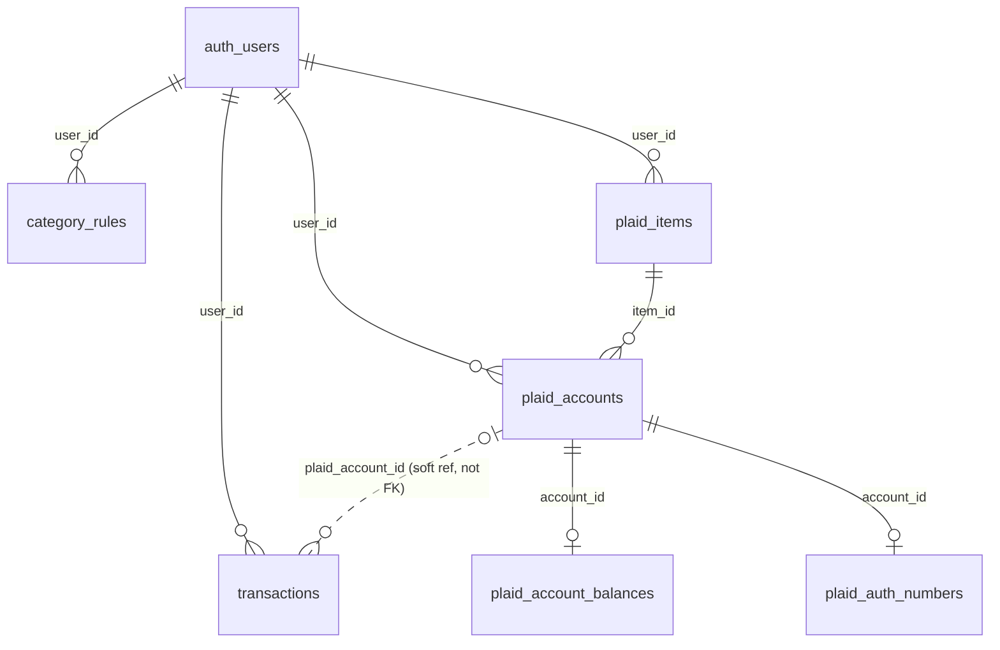

# Database schema

Reference for every table, constraint, and RLS policy in the `public`
schema of this app's Supabase Postgres database. This reflects the **live**
schema (introspected directly from the database, not hand-transcribed from
migration files), current as of 2026-08-04.

The source of truth for schema *changes* is `supabase/migrations/` — this
file is a snapshot for orientation, not a substitute for reading a specific
migration when you need to know exactly why a column exists. Each table
section below links to the migration(s) that created or altered it.

If you change the schema, please update this file in the same PR.

## Contents

- [Overview](#overview)
- [Security model](#security-model)
- [Tables](#tables)
  - [`transactions`](#transactions)
  - [`category_rules`](#category_rules)
  - [`plaid_items`](#plaid_items)
  - [`plaid_accounts`](#plaid_accounts)
  - [`plaid_account_balances`](#plaid_account_balances)
  - [`plaid_auth_numbers`](#plaid_auth_numbers)
- [Functions](#functions)
- [Scheduled jobs](#scheduled-jobs)

## Overview

Two logical groups of tables:

- **The ledger**: `transactions` + `category_rules`. This is what the app's
  Ask/Home pages actually query and display.
- **The Plaid bank-sync layer**: `plaid_items`, `plaid_accounts`,
  `plaid_account_balances`, `plaid_auth_numbers`. These hold live bank
  connections and feed `transactions` (via server-side sync), but are never
  queried directly by the NL-query system — they're plumbing, not
  ledger data.

`auth.users` is Supabase's own managed table (the `auth` schema, not
`public`) — every `user_id` column below is a foreign key into it.

`transactions.plaid_account_id` is deliberately **not** a foreign key (see
[`transactions`](#transactions) below) — that's a load-bearing design
choice, not an oversight.

## Security model

Every table here has Row Level Security (RLS) **enabled**. Two different
patterns are used, depending on sensitivity:

1. **Normal per-user tables** (`transactions`, `category_rules`,
   `plaid_accounts`, `plaid_account_balances`): an RLS policy scoped to
   `auth.uid() = user_id`. Server code that reads these on a user's behalf
   (`api/transactions.js`, `api/query.js`) forwards the *caller's own*
   Supabase access token to PostgREST rather than using a service-role
   key — so it's Postgres itself, not application code, that restricts
   each request to its own rows.

2. **Secret-holding tables** (`plaid_items`, `plaid_auth_numbers`): RLS
   enabled with **no policies at all** for `anon`/`authenticated` — only
   the service-role key (used exclusively in trusted server code: Vercel
   functions, Edge Functions) can touch them. `plaid_items` has one
   narrow exception — a column-level `GRANT` exposing just
   `id, institution_name, status, created_at` to `authenticated`, paired
   with a normal `auth.uid() = user_id` SELECT policy, so the client can
   show "is a bank linked yet" without ever being able to read
   `access_token` or `cursor`. See
   [`20260802010000_lock_down_plaid_items_columns.sql`](supabase/migrations/20260802010000_lock_down_plaid_items_columns.sql)
   — an earlier version of this grant was briefly broader than intended
   (caught and fixed before any real access token was ever stored).

Every `/api/*` route is additionally gated by `middleware.js`, which
rejects any request without a currently-valid Supabase session before it
reaches a handler.

## Tables

### `transactions`

The ledger itself — one row per transaction, manual or bank-synced.

| Column | Type | Nullable | Default | Notes |
|---|---|---|---|---|
| `id` | `bigint` | no | auto | Primary key. |
| `date` | `date` | no | | `YYYY-MM-DD`. |
| `payee` | `text` | no | | Cleaned/display payee (see `raw_payee`). |
| `category` | `text` | no | | `Top:Sub` format (e.g. `Home:Rent`). Always one of a closed set — see `apply_category_rules()`. |
| `amount` | `numeric` | no | | Negative = expense, positive = income. |
| `user_id` | `uuid` | **yes** | | FK → `auth.users.id`. Nullable only because pre-auth rows predate this column; every row written since has one. |
| `plaid_transaction_id` | `text` | yes | | **Unique.** Plaid's own transaction id. `null` for manual rows. This is what makes the sync path idempotent — re-processing the same transaction always upserts the same row instead of inserting a duplicate. |
| `plaid_account_id` | `text` | yes | | Which Plaid account this came from. **Not a foreign key** — see callout below. Indexed. |
| `source` | `text` | no | `'manual'` | `manual` \| `plaid` (checked). |
| `is_transfer` | `boolean` | no | `false` | True for Plaid's `TRANSFER_IN`/`TRANSFER_OUT` categories — money moving between the user's own linked accounts, excluded from spend/income totals by default. |
| `raw_payee` | `text` | yes | | Original, untouched payee (Plaid's or the pre-existing manual value) — never modified by the category-rules engine, so rules can always re-match against the true source value regardless of how many times they've been re-applied. |
| `raw_category` | `text` | yes | | Same idea, for category. |

**Constraints:** PK `id`; unique `plaid_transaction_id`; FK `user_id → auth.users(id)`; check `source in ('manual','plaid')`.
**Indexes:** `date`, `category`, `plaid_account_id`, `(user_id, date desc)`.
**RLS:** `auth.uid() = user_id`, `for all` (read/write).

> **Why `plaid_account_id` has no FK:** Plaid's sync APIs return data for
> *every* account under a bank connection (Item), including any account
> `api/plaid-exchange.js` deliberately chose not to track as a duplicate of
> one you already have. A hard FK would make that filtering a database
> error instead of an application-level choice. The filtering happens in
> `syncItemTransactions.ts` and `refreshAccountBalances.ts` instead —
> see [`api/plaid-exchange.js`](api/plaid-exchange.js) and
> [`supabase/functions/_shared/syncItemTransactions.ts`](supabase/functions/_shared/syncItemTransactions.ts).

Origin: [`20260730231500_add_user_id_and_rls_to_transactions.sql`](supabase/migrations/20260730231500_add_user_id_and_rls_to_transactions.sql),
[`20260802000000_add_plaid_integration_schema.sql`](supabase/migrations/20260802000000_add_plaid_integration_schema.sql),
[`20260803000000_add_is_transfer_to_transactions.sql`](supabase/migrations/20260803000000_add_is_transfer_to_transactions.sql),
[`20260803010000_add_category_rules_engine.sql`](supabase/migrations/20260803010000_add_category_rules_engine.sql)
(`raw_payee`/`raw_category`).

### `category_rules`

User-defined "if payee/category contains X, set category/payee to Y"
rules — same mental model as an email filter with "apply to existing"
checked. Applied both retroactively (`apply_category_rules()`) and
going forward, in the live Plaid sync path.

| Column | Type | Nullable | Default | Notes |
|---|---|---|---|---|
| `id` | `uuid` | no | `gen_random_uuid()` | Primary key. |
| `user_id` | `uuid` | no | | FK → `auth.users.id`, cascades on delete. |
| `priority` | `integer` | no | `100` | Ascending order; ties broken by `created_at`. Higher-priority (later-applied) matches overwrite earlier ones for whichever field they set. |
| `match_field` | `text` | no | | `payee` \| `category` (checked). |
| `match_value` | `text` | no | | Case-insensitive "contains" match. |
| `set_category` | `text` | yes | | Null = don't change category. |
| `set_payee` | `text` | yes | | Null = don't change payee. |
| `enabled` | `boolean` | no | `true` | |
| `created_at` | `timestamptz` | no | `now()` | |
| `updated_at` | `timestamptz` | no | `now()` | |

**Constraints:** PK `id`; FK `user_id → auth.users(id)` (cascade delete); check `match_field in ('payee','category')`.
**RLS:** `auth.uid() = user_id`, `for all`.

Origin: [`20260803010000_add_category_rules_engine.sql`](supabase/migrations/20260803010000_add_category_rules_engine.sql).

### `plaid_items`

One row per linked bank connection ("Item" in Plaid's terminology). Holds
the live access token — the most sensitive row in this schema.

| Column | Type | Nullable | Default | Notes |
|---|---|---|---|---|
| `id` | `uuid` | no | `gen_random_uuid()` | Primary key. |
| `user_id` | `uuid` | no | | FK → `auth.users.id`, cascades on delete. |
| `item_id` | `text` | no | | **Unique.** Plaid's own Item id. |
| `access_token` | `text` | no | | **Secret.** Never exposed to any client role — service-role only. |
| `institution_id` | `text` | yes | | Plaid's institution id (e.g. `ins_56`). |
| `institution_name` | `text` | yes | | Display name (e.g. "Chase"). Client-readable. |
| `cursor` | `text` | yes | | `/transactions/sync` cursor — internal sync bookmark, service-role only. |
| `status` | `text` | no | `'active'` | `active` \| `error` \| `pending_expiration` \| `revoked` (checked). Client-readable. |
| `created_at` | `timestamptz` | no | `now()` | Client-readable. |
| `updated_at` | `timestamptz` | no | `now()` | |

**Constraints:** PK `id`; unique `item_id`; FK `user_id → auth.users(id)` (cascade delete); check `status` enum.
**RLS:** one `SELECT` policy, `auth.uid() = user_id` — combined with a column-level `GRANT` restricting `authenticated` to `id, institution_name, status, created_at` only (see [Security model](#security-model)). No `anon` access at all. No `INSERT`/`UPDATE`/`DELETE` policy for any client role — every write goes through service-role code (`api/plaid-exchange.js`, `api/plaid-disconnect.js`, the `plaid-webhook` Edge Function).

Origin: [`20260802000000_add_plaid_integration_schema.sql`](supabase/migrations/20260802000000_add_plaid_integration_schema.sql),
[`20260802000200_plaid_items_status_read_policy.sql`](supabase/migrations/20260802000200_plaid_items_status_read_policy.sql),
[`20260802010000_lock_down_plaid_items_columns.sql`](supabase/migrations/20260802010000_lock_down_plaid_items_columns.sql).

### `plaid_accounts`

One row per linked bank *account* (a `plaid_items` row can have several —
e.g. checking + savings at the same bank).

| Column | Type | Nullable | Default | Notes |
|---|---|---|---|---|
| `id` | `uuid` | no | `gen_random_uuid()` | Primary key. |
| `item_id` | `uuid` | no | | FK → `plaid_items.id`, cascades on delete. |
| `user_id` | `uuid` | no | | FK → `auth.users.id`, cascades on delete. |
| `account_id` | `text` | no | | **Unique.** Plaid's own account id — scoped per Item (see the duplicate-account note below). |
| `name` | `text` | yes | | e.g. "TOTAL CHECKING". |
| `mask` | `text` | yes | | Last 4 digits, as Plaid reports them. |
| `type` | `text` | yes | | e.g. `depository`. |
| `subtype` | `text` | yes | | e.g. `checking`, `savings`. |
| `created_at` | `timestamptz` | no | `now()` | |

**Constraints:** PK `id`; unique `account_id`; FK `item_id → plaid_items(id)` (cascade delete); FK `user_id → auth.users(id)` (cascade delete).
**RLS:** `auth.uid() = user_id`, `SELECT` only. Writes are service-role only.

> **Why a row here doesn't necessarily mean "a real distinct account":**
> Plaid mints a brand-new `account_id` every time a bank is linked, even
> for an account you already connected — Plaid has no concept of "you
> already have this." `api/plaid-exchange.js` is what prevents a real
> duplicate account from ever getting a row here: it matches a newly
> linked account against your existing *active* accounts (by Auth
> account/routing number, falling back to institution + mask + type when
> Auth isn't available) and skips inserting anything that matches. See
> `partitionDuplicateAccounts` in that file, and its tests in
> [`api/plaid-exchange.test.js`](api/plaid-exchange.test.js).

Origin: [`20260802000000_add_plaid_integration_schema.sql`](supabase/migrations/20260802000000_add_plaid_integration_schema.sql).

### `plaid_account_balances`

Latest known balance per account. Upserted, not appended — one row per
account, always overwritten with the newest value.

| Column | Type | Nullable | Default | Notes |
|---|---|---|---|---|
| `account_id` | `text` | no | | **Primary key.** FK → `plaid_accounts.account_id`, cascades on delete. |
| `user_id` | `uuid` | no | | FK → `auth.users.id`, cascades on delete. |
| `available` | `numeric` | yes | | |
| `current` | `numeric` | yes | | The "ledger" balance the app displays, preferring this over `available`. |
| `iso_currency_code` | `text` | yes | | |
| `as_of` | `timestamptz` | no | `now()` | When this balance was last fetched from Plaid. |

**Constraints:** PK `account_id`; FK `account_id → plaid_accounts(account_id)` (cascade delete); FK `user_id → auth.users(id)` (cascade delete).
**RLS:** `auth.uid() = user_id`, `SELECT` only. Writes are service-role only (`refreshAccountBalances.ts`, shared by the hourly cron and every transaction-sync webhook).

Refreshed hourly (see [Scheduled jobs](#scheduled-jobs)) and opportunistically on every transaction webhook, since Plaid's Balance product has no webhook of its own.

Origin: [`20260802000000_add_plaid_integration_schema.sql`](supabase/migrations/20260802000000_add_plaid_integration_schema.sql).

### `plaid_auth_numbers`

Real account/routing numbers, from Plaid's Auth product. The other
most-sensitive table here.

| Column | Type | Nullable | Default | Notes |
|---|---|---|---|---|
| `account_id` | `text` | no | | **Primary key.** FK → `plaid_accounts.account_id`, cascades on delete. |
| `user_id` | `uuid` | no | | FK → `auth.users.id`, cascades on delete. |
| `account_number` | `text` | no | | **Secret.** |
| `routing_number` | `text` | no | | **Secret.** |
| `wire_routing_number` | `text` | yes | | **Secret.** Not every institution provides one. |
| `created_at` | `timestamptz` | no | `now()` | |

**Constraints:** PK `account_id`; FK `account_id → plaid_accounts(account_id)` (cascade delete); FK `user_id → auth.users(id)` (cascade delete).
**RLS:** enabled, **zero policies** for any client role — not even the owning user can read this table directly. Service-role only. If the UI ever needs to show a masked routing number, that must go through a dedicated server endpoint that masks it, never a direct table select.

Not populated for every account — Auth isn't available for every institution; `api/plaid-exchange.js` treats it as best-effort and doesn't fail a link if it's missing. These numbers double as the primary signal for cross-Item duplicate-account detection (see `plaid_accounts` above).

Origin: [`20260802000000_add_plaid_integration_schema.sql`](supabase/migrations/20260802000000_add_plaid_integration_schema.sql).

## Functions

| Function | Security | Returns | Purpose |
|---|---|---|---|
| `apply_category_rules()` | `INVOKER` | `integer` (rows affected) | Resets every one of the caller's transactions to its `raw_payee`/`raw_category`, then re-applies their `category_rules` in priority order. Always scoped to `auth.uid()` internally — takes no parameters, so a caller can never target another user's rows through it. Invoked from `CategoryRulesPanel.jsx`'s "Reapply now" button. |
| `clean_payee(text)` | `INVOKER` | `text` | Strips statement-descriptor junk (masked account suffixes, reference codes, phone numbers, ACH ID labels, trailing dates/state codes) from a raw payee string. Mirrored in TypeScript as `cleanPayee()` in [`supabase/functions/_shared/categoryRules.ts`](supabase/functions/_shared/categoryRules.ts) for the live sync path — the SQL version exists for retroactive bulk reprocessing. The two are kept manually in sync (one runs in Postgres, one in Deno); if you change the cleaning logic, update both. |

Full logic: [`20260803010000_add_category_rules_engine.sql`](supabase/migrations/20260803010000_add_category_rules_engine.sql),
[`20260803030000_scrub_payee_junk.sql`](supabase/migrations/20260803030000_scrub_payee_junk.sql),
[`20260803040000_closed_category_set.sql`](supabase/migrations/20260803040000_closed_category_set.sql),
[`20260803050000_scrub_transfer_and_reference_junk.sql`](supabase/migrations/20260803050000_scrub_transfer_and_reference_junk.sql).

## Scheduled jobs

| Job | Schedule | What it does |
|---|---|---|
| `plaid-balance-refresh` | Hourly (`pg_cron` + `pg_net`) | Calls the `plaid-balance-refresh` Edge Function for every `active` `plaid_items` row, refreshing `plaid_account_balances`. Plaid's Balance product has no webhook, so this polling job is the only way stale balances (accounts that haven't transacted recently) stay current. Authenticated via a service-role key stored in Supabase Vault (`plaid_balance_refresh_service_key`) — never hardcoded in a migration file. |

Origin: [`20260802000100_schedule_plaid_balance_refresh.sql`](supabase/migrations/20260802000100_schedule_plaid_balance_refresh.sql).
